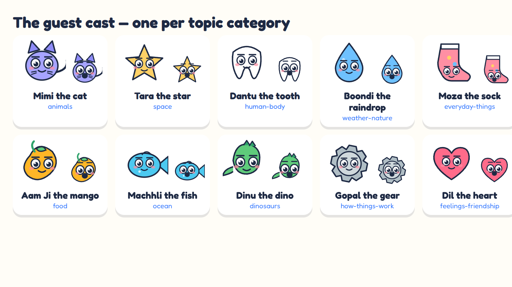

# Bolt & Pip

A free, human-reviewed pipeline that makes **one original 45–58 second kids' YouTube Short per
day**, starring **Bolt** — a small, friendly, hand-built SVG robot — and sends every draft to you
on Telegram. Either nothing is uploaded until you reply `/approve`, or (auto-approve mode) every
draft that passes the AI review is scheduled and you keep a `/reject` veto until it goes public. Once a week it compiles the approved
Shorts into a 5–8 minute landscape video, also approval-gated.

- **Cost: ₹0 / $0 per month.** Free API tiers, open-source tools, GitHub Actions on a public repo.
- **Stack:** TypeScript · Node 20+ · React · Remotion · kokoro-js (TTS) · whisper.cpp (captions) ·
  Gemini/Groq (scripts) · Telegram Bot API · YouTube Data API v3 · GitHub Actions + Releases.
- **The cast:** Bolt plus **Pip**, his tiny yellow bird friend who guesses wrong, giggles and cheers —
  a duo, a signature jingle, a clumsy "oops" wobble and named feelings: the traits the most-loved
  kids' cartoons share, all original and hand-built.
- **Not a content farm:** one consistent character, voice and look; varied topics with no repeats;
  independent AI review + deterministic safety validation; a human approval before anything is public;
  at most one Short per day.

<p align="center"></p>

**Comedy beats.** Every Short has two built-in gags: one of the three guess bubbles is deliberately
silly and Pip picks it (and is wrong), and a **guest character** chosen by topic category pops in
after the wow fact with a one-liner in its own voice while Bolt reacts (laugh / oops / wow). The
guest cast is original and hand-built, one per category:

<p align="center"></p>

Personas can switch the gags off (`"gags": false`), which the client brand-kit example does.

**Status: live.** The first Short produced entirely by this pipeline on GitHub Actions
(Gemini script → independent review → Kokoro voice → whisper captions → Remotion render →
Telegram `/approve` → YouTube upload) is scheduled on
[youtube.com/@BoltPip-f5k](https://www.youtube.com/@BoltPip-f5k). Day-to-day operation is
described in [docs/RUNBOOK.md](docs/RUNBOOK.md); `npm run branding` renders each channel's avatar,
banner and about text.

## How it works

```
GitHub Actions (daily)                  GitHub Actions (hourly)
generate.yml                            publish.yml
 ├ pick topic (no repeats, rotating)     ├ read your Telegram replies (getUpdates)
 ├ write script (Gemini → Groq)          ├ /approve → upload private + scheduled to YouTube
 ├ review script (2nd LLM pass)          ├ /reject  → mark rejected · /redo → regenerate topic
 ├ validate in code (safety, length)     ├ remind once after 48 h · never auto-publish
 ├ voice (kokoro-js, local)              └ commit data/state.json
 ├ word timings (whisper.cpp)
 ├ render MP4 (Remotion)                weekly.yml (Sunday)
 ├ store draft as a GitHub Release asset ├ compile the week's approved Shorts (landscape)
 └ send to Telegram for approval         └ same approval + upload flow, with chapters + thumbnail
```

Every Short has the same beats: **hook question → "What do you think?" with three answer bubbles
→ simple answer with one comparison (the right bubble pops) → wow fact → Bolt's tiny safe
experiment → "Stay curious, friends!"** (all configurable). The guess beat is what makes the
channel feel like a game rather than a lecture: children predict first, then learn — and it
invites real comments without any engagement bait.

## Quick start (local, no accounts needed)

```bash
git clone <this repo> bolt-shorts && cd bolt-shorts
npm install                # Node 20+ (22 recommended); needs git + cmake for whisper.cpp
npm test && npm run typecheck && npm run lint

npm run showcase           # Bolt's pose × expression sheet → out/showcase/
npm run generate -- --dry-run --fallback     # full pipeline with a hand-written script → out/
npm run studio             # Remotion Studio with the sample Short loaded
```

The first `generate` downloads the Kokoro model (~90 MB, cached in `.cache/hf`) and builds
whisper.cpp (cached in `.cache/whisper`). With no AI keys it uses one of the 14 hand-checked
scripts in `data/fallback-scripts/`. Add a Gemini key (2 minutes, free — `docs/SETUP_AI_KEYS.md`)
and drop `--fallback` to get a fresh script that passes the reviewer and validator.

Other scripts:

| Command | What it does |
| --- | --- |
| `npm run generate -- --topic animals-003` | force a topic (see `data/topics.json`) |
| `npm run generate -- --dry-run --skip-render` | script + audio + props only, fast |
| `npm run preview -- --stills 1,12,33,55` | render PNG frames of the sample Short for visual QA |
| `npm run weekly -- --dry-run` | 5 sample scripts → `out/weekly-dryrun/long.mp4` + `thumbnail.png` |
| `npm run publish` | process Telegram commands, upload approved drafts |
| `npm run auth:youtube` | one-time OAuth helper that prints `YOUTUBE_REFRESH_TOKEN` |
| `npm run smoke` | 3-second render used by CI |

## Setting up the daily pipeline (from zero)

Each step has a click-by-click guide. Total time about 45 minutes.

1. **Fork / push this repo to GitHub (public).** Public repos get unlimited free Actions minutes.
   Nothing sensitive is stored in the repo: secrets live in GitHub Secrets and the logger redacts
   them from logs.
2. **Telegram bot** — `docs/SETUP_TELEGRAM.md` → secrets `TELEGRAM_BOT_TOKEN`, `TELEGRAM_CHAT_ID`.
3. **AI keys** — `docs/SETUP_AI_KEYS.md` → secrets `GEMINI_API_KEY` (and optionally `GROQ_API_KEY`).
4. **YouTube** — `docs/SETUP_YOUTUBE.md` → secrets `YOUTUBE_CLIENT_ID`, `YOUTUBE_CLIENT_SECRET`,
   `YOUTUBE_REFRESH_TOKEN` (run `npm run auth:youtube` locally to get the last one). Publish the
   OAuth consent screen so the token does not expire after 7 days.
5. **Channel settings** — edit `config/channel.json`: name, handle, catchphrase, timezone,
   `uploadTime` (default 17:00), voice, music volume. The daily cron time is in
   `.github/workflows/generate.yml` (default 01:30 UTC = 07:00 IST).
6. **Enable workflows** — GitHub → *Actions* tab → enable. Run **Generate daily Short** manually
   with `dryRun = true` once to warm the caches (Kokoro, whisper, browser), then once for real.
   You will receive the video and script on Telegram within ~10 minutes.
7. **Review** on Telegram: `/approve <draftId>`. The hourly publish job uploads it as private,
   scheduled for the next free `uploadTime`. `/status` shows the queue.

Music: the repo ships an original generated loop; to use a YouTube Audio Library track see
`assets/music/README.md`.

## Repository map

```
config/            channel.json (identity, language table, timezone, upload time), banned-words.json
data/              topics.json (370 kid questions), state.json (drafts, approvals), fallback-scripts/
src/cli/           generate, publish, weekly, preview, showcase, smoke, authYoutube
src/content/       topicPicker, writer, reviewer, validate, prompts/, fallback, timeline
src/llm/           gemini, groq, provider chain with retry + defensive JSON
src/audio/         tts (kokoro-js), timings (whisper.cpp) + align, mix, wav, music, placeholder
src/video/         render.ts (Remotion bundler/renderer API, browser selection)
src/publish/       telegram, releases (GitHub), youtube, schedule (publishAt slots)
src/state/         zod-typed state with tested transitions, atomic writes
remotion/          Root, compositions/ (Short, LongVideo, Thumbnail, BoltShowcase, Episode),
                   character/ (Bolt.tsx, poses, expressions), scenes/, backgrounds/, components/, theme.ts
docs/              SETUP_*, CONTENT_POLICY, DECISIONS, HINDI, TOOL_EVALUATION, PROOF (rendered evidence)
.github/workflows/ generate.yml, publish.yml, weekly.yml, ci.yml
```

## Safety, by design

- Two LLM passes (writer, then an independent reviewer/fact-checker — on a *different* model when
  both Gemini and Groq keys exist), then a **deterministic
  validator** in code: word counts, estimated length, banned words, hazard words in experiments,
  invented statistics, engagement bait, "ask a grown-up" when anything is handled
  (`src/content/validate.ts`, unit-tested). Failing scripts are never rendered.
- `docs/CONTENT_POLICY.md` is your review checklist.
- Uploads are always `private` + `publishAt`, `selfDeclaredMadeForKids: true`, with the synthetic
  content disclosure set (`config/channel.json → youtube`).

## Personas: one pipeline, any channel

A persona is a full channel definition (character, audience, tone, topics, word lists, colours,
logo, YouTube identity). `bolt-pip` is the default; `config/personas/` ships `ncert-science`
(NCERT class 6–10 science, general audience, exam tips) and `demo-coaching` (a client brand kit
for the explainer-video service). `CHANNELS=["bolt-pip/en","ncert-science/hi"]` runs any mix.
See [docs/PERSONAS.md](docs/PERSONAS.md).

## Languages and channels

English and **Hindi** are built in, and each language is its own YouTube channel run from the same
repo and the same Telegram chat:

- `config/channel.json → languages.<lang>` holds the catchphrase, safety phrases, on-screen labels,
  font (Baloo 2 for Devanagari), voice engine and the channel's own name, handle and tags.
- Repository variable `CHANNEL_LANGUAGES` (JSON array, e.g. `["en","hi"]`) drives a one-language-at-a-time
  matrix in the generate and weekly workflows. Each language keeps its own topic history in
  `data/state.json`; draft ids and release tags carry the language (`short-2026-09-19-hi-ocean-002`).
- Uploads route by language: the default language uses `YOUTUBE_REFRESH_TOKEN`, every other one needs
  `YOUTUBE_REFRESH_TOKEN_<LANG>` (`npm run auth:youtube -- --language hi`). A draft is never uploaded
  with another channel's token.
- Voices: English → Kokoro (local). Hindi → **Gemini TTS** (free tier, natural), eSpeak-NG as the
  offline fallback. `docs/HINDI.md` has the details and how to add a third language.

## Environment variables

See `.env.example`. Locally, copy it to `.env`. In Actions, add the same names as secrets
(`GEMINI_MODEL`, `GEMINI_TTS_MODEL`, `GROQ_MODEL`, `CHANNEL_LANGUAGES` are plain *variables*).

## Troubleshooting

| Symptom | Fix |
| --- | --- |
| `Failed to launch the browser process` | Set `REMOTION_BROWSER_EXECUTABLE` to a Chrome/Chromium binary, or unset `REMOTION_PREFER_DOWNLOADED_BROWSER` and let Remotion download its headless shell. |
| `Text-to-speech failed … Forbidden access to file: https://huggingface.co/…` | The machine cannot reach Hugging Face. Check the network/proxy; for an offline test render use `--dry-run --voice espeak` (bundled eSpeak-NG: robotic but clear) or set `ALLOW_FALLBACK_VOICE=1`. |
| `whisper.cpp unavailable … using estimated word timings` | Install `git` and `cmake` (Linux/macOS); captions still work with estimated timings. |
| Telegram `Bad Request: chat not found` | Press *Start* in the bot chat first; check `TELEGRAM_CHAT_ID`. |
| YouTube `invalid_grant` after a week | Publish the OAuth consent screen (`docs/SETUP_YOUTUBE.md`), re-run `npm run auth:youtube`. |
| Upload landed on the wrong channel | The token was issued for the personal channel, not the brand channel. `npm run auth:youtube -- --whoami` shows which; re-run `npm run auth:youtube` and pick the brand channel on the chooser. |
| `quotaExceeded` | Wait for the daily reset; the draft stays queued. |

## Licence notes

Code in this repo: MIT. Bolt, the channel name and scripts are yours. Remotion is free for
individuals and companies with up to 3 people (see its LICENSE). Fredoka font: SIL OFL.
Kokoro-82M weights: Apache-2.0. Music: generated here (original) or from the YouTube Audio Library.
