# Proof of output

Generated 2026-09-16T19:45:23.994Z by `npm run proof` from the files in `out/`. Everything below was measured or extracted from the actual rendered MP4s — nothing is mocked.

> Voice note: renders made in an environment without Hugging Face access use the clearly-labelled placeholder robot-babble voice (`voice=placeholder` in the log). The amplitude envelope is speech-like, so lip sync, captions, ducking and timing are exercised identically; on your machine or GitHub Actions the Kokoro voice is used and `generate` refuses to publish a placeholder-voiced draft.

## Short (1080×1920)

```
codec_name=h264
codec_type=video
width=1080
height=1920
r_frame_rate=30/1
codec_name=aac
codec_type=audio
sample_rate=48000
channels=2
r_frame_rate=0/0
duration=56.512000
size=11231605
```

- Title: **Why is the sky blue?** · sections: hook 6.096s, answer 19.6s, wow 10.0s, experiment 12.9s, sign-off 1.7s · total 56.5s (hard max 59s)
- Captions source: estimated; guess beat: 2.8s pause

Measured loudness (voice vs. music-only gaps — music is ducked under speech):

- speech: 0.6–2.5 s: -22.1 dBFS
- gap after hook (music only): 6.4–6.8 s: -48.1 dBFS
- speech: 10.3–12.3 s: -22.3 dBFS
- sign-off tail (music only, fading): 54.9–56.3 s: -47.8 dBFS

| Beat | Time | Frame |
| --- | --- | --- |
| hook | 1.4s | 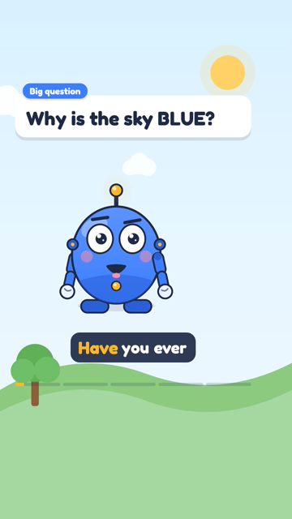 |
| guess bubbles | 7.7s | 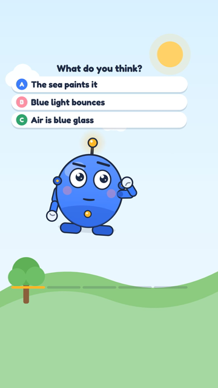 |
| reveal | 10.0s | 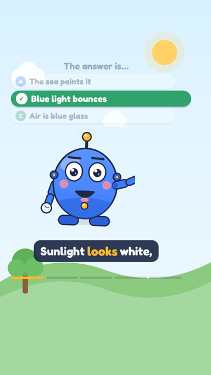 |
| answer | 13.3s | 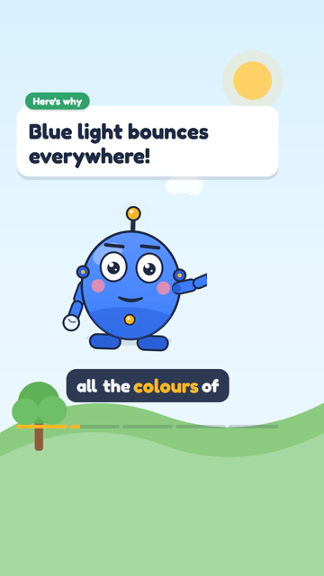 |
| wow fact (antenna glow) | 31.2s | 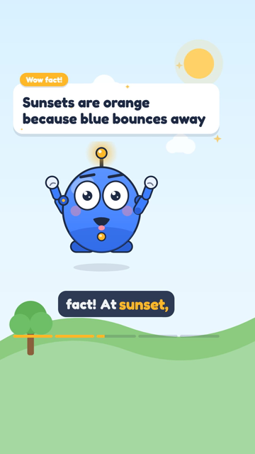 |
| experiment (badge) | 41.5s | 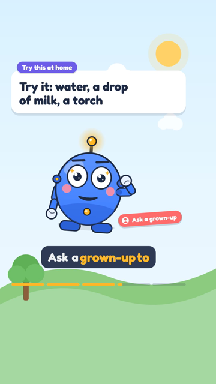 |
| sign-off (channel name) | 55.9s | 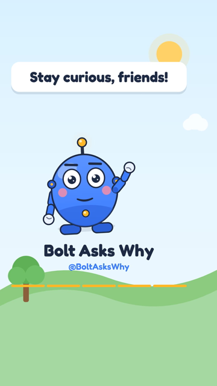 |

Eight consecutive frames (1/30 s apart) during speech — the mouth follows the syllables:

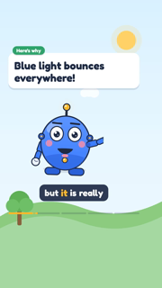   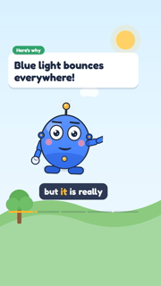    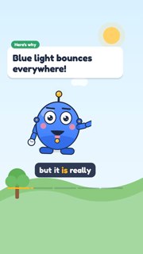

## Weekly compilation (1920×1080)

```
codec_name=h264
codec_type=video
width=1920
height=1080
r_frame_rate=30/1
codec_name=aac
codec_type=audio
sample_rate=48000
channels=2
r_frame_rate=0/0
duration=303.061333
size=51943297
```

Chapters written into the YouTube description:

```
00:00 Why is the sky blue?
01:01 Why do cats purr?
02:00 Why does the Moon change shape?
03:01 Why do we yawn?
03:59 Why does it rain?
```

| Beat | Time | Frame |
| --- | --- | --- |
| intro | 1.5s | 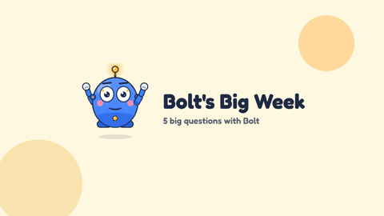 |
| chapter card | 3.5s | 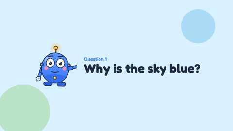 |
| episode 1 | 12.0s | 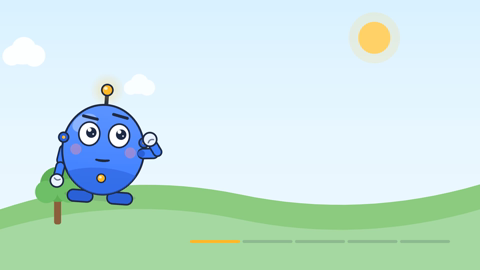 |
| episode 2 (hook) | 66.0s | 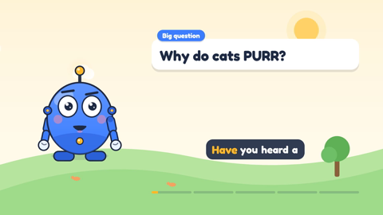 |
| outro | 301.0s | 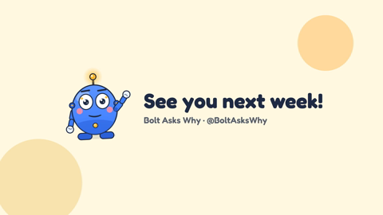 |

Thumbnail (1280×720):

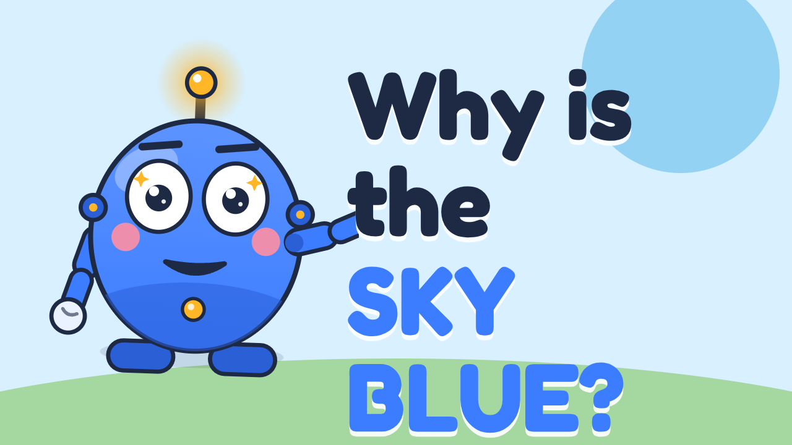

## Design sheet

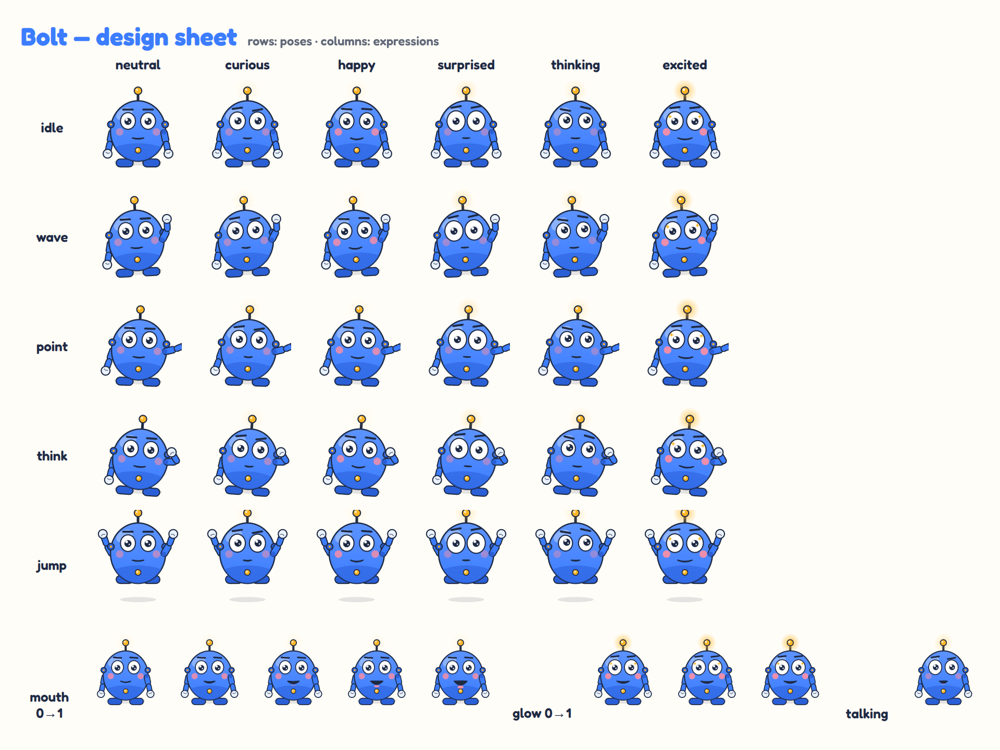

## Checks

- `npm test` (unit tests: picker, validator, aligner, state, scheduling, Telegram commands, captions, chapters)
- `npm run typecheck`, `npm run lint`
- `npx remotion compositions remotion/index.ts` lists Short, LongVideo, Thumbnail, BoltShowcase

