# Proof of output

Generated 2026-09-17T05:49:17.165Z by `npm run proof` from the files in `out/`. Everything below was measured or extracted from the actual rendered MP4s — nothing is mocked.

> Voice note: renders made in an environment without Hugging Face access use the bundled **eSpeak-NG** voice (`voice=espeak` in the log) — real, intelligible speech with a robotic timbre. On your machine or GitHub Actions the natural **Kokoro** voice is used, and `generate` refuses to publish audio that does not come from the configured engine.

## Short — en (1080×1920)

```
codec_name=h264
codec_type=video
width=1080
height=1920
r_frame_rate=30/1
codec_name=aac
codec_type=audio
sample_rate=48000
channels=2
r_frame_rate=0/0
duration=53.482667
size=12623118
```

- Title: **Why is the sky blue?** · sections: hook 5.588s, answer 18.0s, wow 9.7s, experiment 11.5s, sign-off 1.9s · total 53.4s (hard max 59s)
- Captions source: estimated; guess beat: 2.8s pause

Measured loudness (voice vs. music-only gaps — music is ducked under speech):

- speech: 1.1–3.1 s: -23.0 dBFS
- gap after hook (music only): 6.5–6.9 s: -47.9 dBFS
- speech: 10.3–12.3 s: -21.2 dBFS
- sign-off tail (music only, fading): 51.8–53.2 s: -52.9 dBFS

| Beat | Time | Frame |
| --- | --- | --- |
| hook | 2.0s | 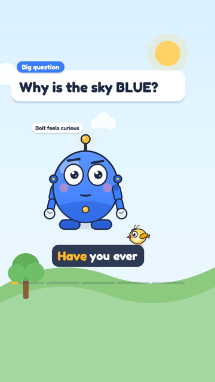 |
| guess bubbles | 7.7s | 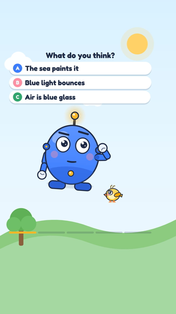 |
| reveal | 10.0s | 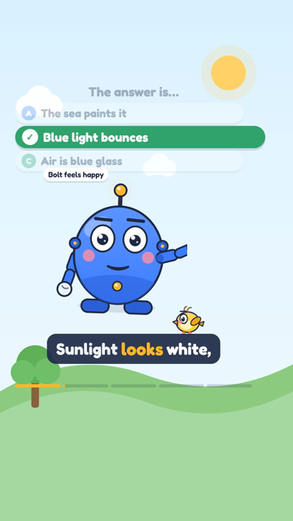 |
| answer | 13.3s | 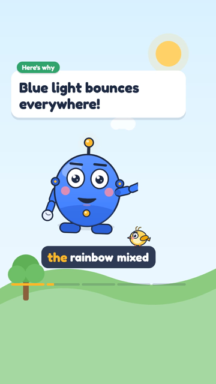 |
| wow fact (antenna glow) | 29.7s | 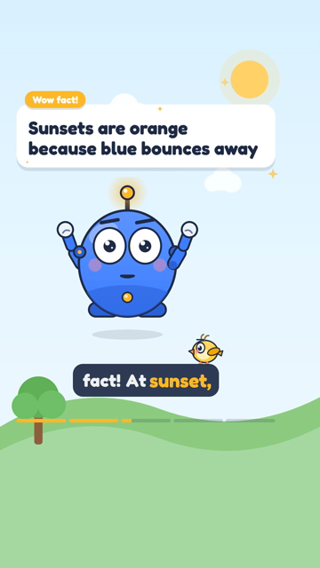 |
| experiment (badge) | 39.7s |  |
| sign-off (channel name) | 52.8s | 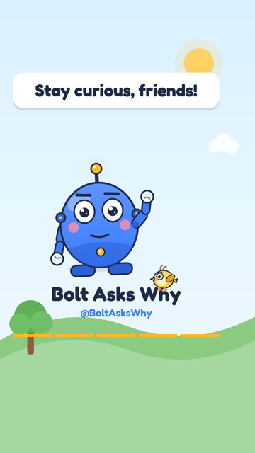 |

Eight consecutive frames (1/30 s apart) during speech — the mouth follows the syllables:

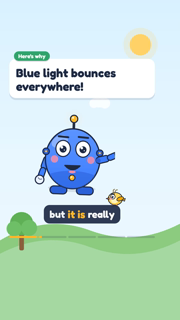   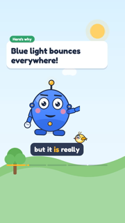   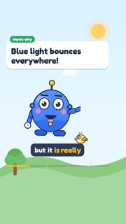 

## Short — hi (1080×1920)

```
codec_name=h264
codec_type=video
width=1080
height=1920
r_frame_rate=30/1
codec_name=aac
codec_type=audio
sample_rate=48000
channels=2
r_frame_rate=0/0
duration=53.482667
size=12499389
```

- Title: **आसमान नीला क्यों है?** · sections: hook 6.567s, answer 17.9s, wow 10.3s, experiment 10.4s, sign-off 1.6s · total 53.4s (hard max 59s)
- Captions source: estimated; guess beat: 2.8s pause

Measured loudness (voice vs. music-only gaps — music is ducked under speech):

- speech: 1.1–3.1 s: -21.7 dBFS
- gap after hook (music only): 7.5–7.9 s: -46.6 dBFS
- speech: 11.3–13.3 s: -22.2 dBFS
- sign-off tail (music only, fading): 51.8–53.2 s: -52.9 dBFS

| Beat | Time | Frame |
| --- | --- | --- |
| hook | 2.0s | 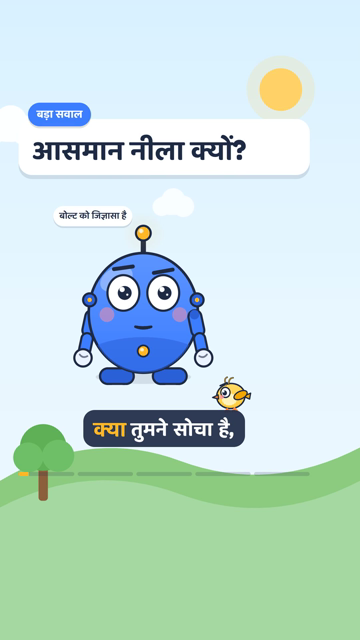 |
| guess bubbles | 8.7s | 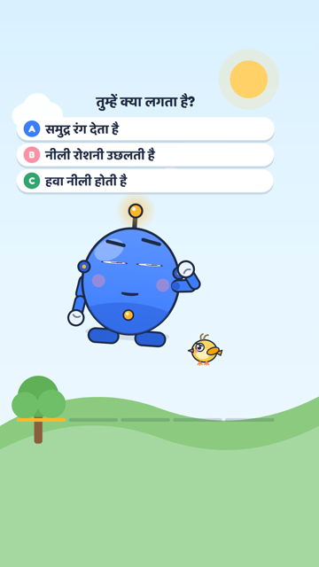 |
| reveal | 11.0s | 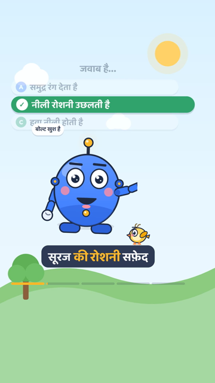 |
| answer | 14.3s | 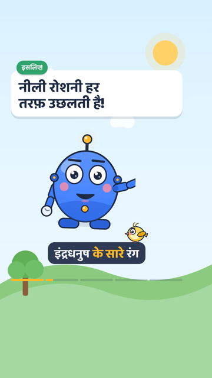 |
| wow fact (antenna glow) | 30.5s | 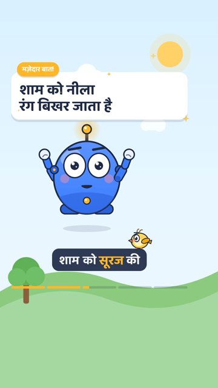 |
| experiment (badge) | 41.1s | 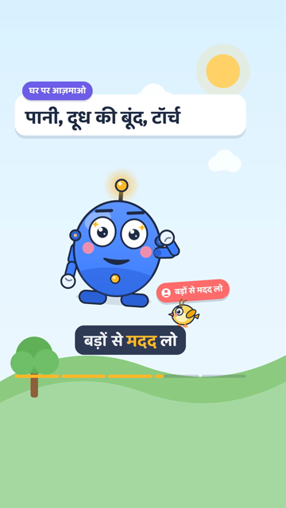 |
| sign-off (channel name) | 52.8s | 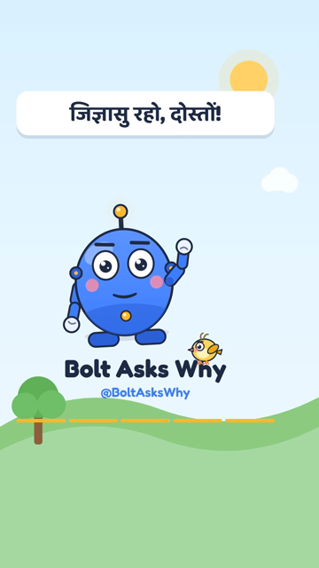 |

Eight consecutive frames (1/30 s apart) during speech — the mouth follows the syllables:

       

## Weekly compilation (1920×1080)

```
codec_name=h264
codec_type=video
width=1920
height=1080
r_frame_rate=30/1
codec_name=aac
codec_type=audio
sample_rate=48000
channels=2
r_frame_rate=0/0
duration=284.821333
size=55577417
```

Chapters written into the YouTube description:

```
00:00 Why is the sky blue?
00:58 Why do cats purr?
01:55 Why does the Moon change shape?
02:50 Why do we yawn?
03:44 Why does it rain?
```

| Beat | Time | Frame |
| --- | --- | --- |
| intro | 1.5s |  |
| chapter card | 3.5s |  |
| episode 1 | 12.0s |  |
| episode 2 (hook) | 63.0s |  |
| outro | 282.8s |  |

Thumbnail (1280×720):


## Design sheet (Bolt + Pip)


## Checks

- `npm test` (unit tests: picker, validator, aligner, state, scheduling, Telegram commands, captions, chapters)
- `npm run typecheck`, `npm run lint`
- `npx remotion compositions remotion/index.ts` lists Short, LongVideo, Thumbnail, BoltShowcase

